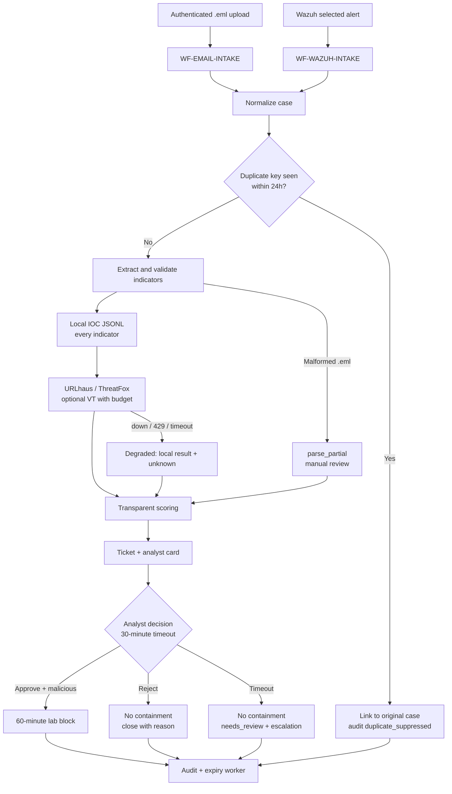

# Phishing SOAR: Report → Enrich → Approve → Respond

A small, credible SOC automation that turns a reported `.eml` or a Wazuh authentication / malicious-IP alert into one normalized case. It extracts and enriches indicators, scores them with a fully explainable model, pauses for an analyst decision, applies only approved, reversible, time-boxed containment, and records every step in a hash-chained audit ledger.

> **Safety:** all fixtures are synthetic and use reserved/documentation domains and IPs. The playbook never opens URLs, never resolves or follows them, never executes or uploads attachments, and only performs reputation *lookups*. Containment defaults to `RESPONSE_MODE=simulate`, which is the only mode implemented so far.

The design favours reliability over breadth. URLhaus and ThreatFox are the normal intelligence sources, VirusTotal is optional and quota-capped, and a versioned local IOC mirror is consulted on every case. An API outage therefore degrades enrichment but never prevents triage, and "unknown" is never treated as "clean".

## Build status

This repository follows the seven-day plan in the project blueprint. Current state:

| Day | Deliverable | Status |
|---:|---|---|
| 1 | Schemas, local storage, sample events, threat model | ✅ `schemas/`, SQLite + JSONL state, fixtures, [threat model](docs/threat-model.md). Lab services: SOAR API + Mailpit compose file; Shuffle and Wazuh deploy from upstream (not stood up yet) |
| 2 | `.eml` parser, Wazuh normalizer, fixtures, unit tests | ✅ |
| 3 | Local IOC index, URLhaus / ThreatFox adapters, optional VT | ✅ Adapters tested against recorded responses; **live API check pending** (provider docs were not reachable from the build environment) |
| 4 | Scoring engine, explanations, synthetic cases, thresholds | ✅ Golden scores P1 74, P2 53, P3 5, W1 90, P1-offline 69 |
| 5 | Shuffle workflows, dedupe, notification, approve/reject/timeout | 🟡 Logic and HTTP API done and tested; Shuffle workflows designed in [`workflows/EXPORT_NOTES.md`](workflows/EXPORT_NOTES.md) but not yet built or exported |
| 6 | Temporary blocklist, expiry worker, audit chain, failure paths | 🟡 Done in simulate mode; Wazuh timed-block adapter pending |
| 7 | Metrics runs, screenshots, docs, exports, demo | 🟡 Metrics tooling, docs and demo script done; measured runs, screenshots, workflow exports and video pending |

## Architecture



Shuffle orchestrates and keeps the visual execution trace. All decisions live in the `phishing_soar` Python package (standard library only), which Shuffle calls over a small authenticated HTTP API. That keeps the logic unit-testable and lets the platform be swapped without touching it. Details are in [docs/architecture.md](docs/architecture.md).

| What is automated | What needs a human |
|---|---|
| Intake validation, hashing, dedupe, MIME parsing, IOC extraction | Verdict (`malicious` / `benign` / `suspicious_no_action`) and a written reason |
| Local + remote reputation lookups, caching, circuit breaking, quota | Approving each specific containment action (target, scope, TTL) |
| Scoring, explanation, containment *proposal*, ticket, notifications | Manual rollback, timeout follow-up, response-failure review |
| Expiry of approved blocks, audit chain, metrics | — |

## Quickstart (no lab services needed)

Requires Python ≥ 3.10. There are no runtime dependencies.

```bash
python -m venv .venv && . .venv/bin/activate
pip install -e ".[dev]"
pytest                                   # 172 tests
python scripts/run_demo.py --check       # deterministic end-to-end demo
```

`run_demo.py` uses a fixed clock and recorded provider answers. Its output, with the random case IDs omitted:

```text
scenario      score      enrichment          decision  outcome       actions                         note
W1            90 HIGH    online/complete     approved  responded     temporary_ip_block:success      expiry removed 1 block(s)
P3            5 LOW      online/complete     rejected  closed        none
P2            53 MEDIUM  online/complete     approved  responded     none                            auth pass != benign
P1            74 HIGH    online/complete     approved  responded     temporary_domain_block:success
P1-truncated  74 HIGH    online/complete     timeout   needs_review  none                            parse_partial, left undecided -> timeout
P1-offline    69 HIGH    offline/local_only  timeout   needs_review  none                            providers timed out; left undecided -> timeout

duplicate P1 -> duplicate_suppressed (linked to <P1 case>, occurrence 2)
audit chain [online]: OK (50 events, 5 cases)
audit chain [offline]: OK (9 events, 1 cases)
```

### Drive it by hand (CLI)

```bash
cp .env.example .env    # then edit; never commit .env
set -a; . ./.env; set +a
phishing-soar --replay tests/fixtures/provider_responses/manifest.json \
  ingest-wazuh tests/fixtures/wazuh/w1_bruteforce_success.json      # prints card + approval token
phishing-soar decide <case_id> --token <token> --decision approve --verdict malicious \
  --reason "Brute force then root login; exact IOC" --analyst analyst-lab --action <action_id>
phishing-soar expire          # removes blocks whose TTL has passed
phishing-soar verify-audit    # recomputes the hash chain
phishing-soar metrics --out data/runtime/metrics.csv
```

Drop `--replay` and set `URLHAUS_AUTH_KEY` / `THREATFOX_AUTH_KEY` to query the real providers. Use `--offline` to prove the fallback.

### HTTP API for Shuffle

```bash
phishing-soar serve --host 127.0.0.1 --port 8088     # requires SOAR_API_TOKEN (≥ 24 chars)
python scripts/submit_eml.py tests/fixtures/eml/p1_credential_harvest.eml \
  --url http://127.0.0.1:8088/v1/intake/email --reporter alex.analyst@lab.example
```

Routes: `POST /v1/intake/email`, `POST /v1/intake/wazuh`, `POST /v1/cases/<id>/decision`, `GET /v1/cases/<id>`, `POST /v1/actions/<id>/rollback`, `POST /v1/jobs/approval-timeouts`, `POST /v1/jobs/expire`, `GET /healthz`. Every route except `/healthz` requires `Authorization: Bearer $SOAR_API_TOKEN`. `docker-compose.lab.yml` runs the API and Mailpit; Shuffle and Wazuh are deployed from their upstream instructions (see [docs/architecture.md](docs/architecture.md#lab-deployment)).

## Configuration

| Variable | Default | Purpose |
|---|---|---|
| `SOAR_API_TOKEN` | — | Bearer token for the HTTP API (required for `serve`) |
| `SOAR_DATA_DIR` | `data/runtime` | Cases, audit ledger, SQLite state, tickets, outbox (Git-ignored) |
| `SOAR_POLICY_FILE` | built-in empty policy | Allowlists, protected targets, trusted MTAs, privileged users ([`config/lab-policy.json`](config/lab-policy.json)) |
| `SOAR_IOC_PATHS` | `data/ioc/local_iocs.seed.jsonl` | Comma-separated local IOC JSONL files |
| `RESPONSE_MODE` | `simulate` | Only `simulate` is implemented |
| `SOAR_OFFLINE` | `false` | Disable all remote lookups |
| `SOAR_LAB_DOC_RANGES_ROUTABLE` | `false` | Treat RFC 5737/3849 documentation IPs as public so the synthetic fixtures can be enriched and blocked. **Lab fixtures only** |
| `URLHAUS_AUTH_KEY`, `THREATFOX_AUTH_KEY` | — | Free abuse.ch Auth-Keys; missing key ⇒ provider `unknown`, never clean |
| `VT_ENABLED` / `VT_API_KEY` | `false` / — | Optional VirusTotal report lookups (never uploads) |
| `VT_PER_MINUTE` / `VT_PER_DAY` | `3` / `100` | Local VT budget, below the public API default |
| `SOAR_APPROVAL_TIMEOUT_SECONDS` | `1800` | Approval window; timeout never contains |
| `SOAR_BLOCK_TTL_SECONDS` | `3600` | Block TTL; values above 3600 are refused |
| `SOAR_NOTIFY_MODE` | `file` | `file` (outbox JSONL) or `smtp` (e.g. Mailpit on `SOAR_SMTP_HOST:SOAR_SMTP_PORT`) |

## Risk model (summary)

`score = min(100, Σ min(category points, category cap))`: 0–29 LOW, 30–59 MEDIUM, 60–100 HIGH. Every factor stores its evidence, nominal and applied points, cap and source, so the total recomputes exactly. Unknown enrichment adds zero and is listed separately. The full tables, worked examples and tuning rules are in [docs/scoring-model.md](docs/scoring-model.md). The weights live in [`src/phishing_soar/scoring_model.json`](src/phishing_soar/scoring_model.json) (`email-1.0`, `wazuh-1.0`).

Example (W1):

```text
+35 rep_exact          ip 198[.]51[.]100[.]44 exact malicious match [local_ioc,threatfox]
 +5 rep_corrob         2 independent sources agree                  (reputation 40/40)
+15 auth_fail_burst    18 failures from one IP in 5m
+10 multi_user         3 distinct usernames targeted in 5m
+15 success_after_fail successful login followed failures            (behavior 40/40)
+10 privileged_user    root                                          (context 10/20)
= 90 HIGH → proposes temporary_ip_block on agent linux-lab-01 for 3600 s; analyst approval required
```

## Failure and offline behaviour

| Failure | Behaviour |
|---|---|
| Provider timeout / 5xx | One jittered retry; circuit opens after 3 failures in 5 min; result `unknown`; case `enriched_degraded` |
| HTTP 429 | No retry; honours `Retry-After`; provider skipped for the rest of the case |
| All providers down | Local IOC still checked; `enrichment_mode=offline`, `completeness=local_only`; scoring continues (P1 → 69 HIGH) |
| Malformed `.eml` | `parse_partial`, warnings preserved, safe extraction continues, manual-review flag |
| Duplicate within 24 h | Linked to the original case; no re-enrichment, no second action |
| Analyst timeout | No containment, `needs_review`, escalation notification |
| Containment add/remove failure | One idempotent retry; `response_failed_needs_review` or high-priority rollback alert; block stays tracked |
| Audit write failure | Workflow fails loudly; success is never reported |

## Tests

`pytest` runs 172 tests covering canonicalization, parsing, normalization, enrichment fallback (timeouts, 429, malformed JSON, cache, stale IOCs, VT budget), golden scores and boundaries (29/30, 59/60), caps, deduplication, approval/reject/timeout/double-click/forged-token, protected-target refusal, expiry and rollback, audit tamper detection, concurrent ledger writes, schema validation and the HTTP API. CI runs them on Python 3.10 and 3.12, together with ruff and the demo in `--check` mode.

## Metrics

`phishing-soar metrics` exports one row per case: `case_id, source_type, scenario, score, band, enrichment_mode, cache_mode, processing_seconds, analyst_active_seconds, approval_wait_seconds, response_seconds, time_to_triage_seconds, time_to_contain_seconds, outcome, duplicate, error_count`. The method (manual baseline, ≥ 5 automated runs, medians and ranges, separate clocks, no "MTTR") is in [docs/metrics-method.md](docs/metrics-method.md).

**No measured results yet.** Numbers will be added only after the timed baseline and lab runs exist.

## Security design and known limitations

- Least privilege by stage: intake creates cases, enrichment only reads reputation, response only adds/removes time-boxed entries in a dedicated lab list.
- Approval tokens are random and single-use. They are stored only as hashes, bound to the case and to the exact proposed-action hash, and expire after 30 minutes. Tokens, secrets and message bodies are redacted from audit, tickets and notifications.
- Display output is defanged everywhere (`hxxps://evil[.]example`).
- The audit ledger is **tamper-evident**, not immutable. Production would forward it to access-controlled WORM storage.
- Local approval identity is weaker than SSO/RBAC; a second approver for high-impact actions is a stretch goal.
- The organizational-domain check approximates the Public Suffix List.
- Provider adapters follow the documented URLhaus/ThreatFox/VirusTotal APIs but have only been exercised against recorded responses so far.
- The scores are calibrated on four synthetic fixtures. They prove mechanics, not detection efficacy.

Full analysis: [docs/threat-model.md](docs/threat-model.md).

## Production mapping

Replace adapters, not decision logic. The mailbox button or Graph/Gmail API feeds the same `/v1/intake/email` contract. ServiceNow/Jira/TheHive replace `tickets/`. Teams/Slack/pager replace the notifier. An email gateway, SWG or edge firewall replaces `SimulatedBlocklist` with the same receipt and rollback contract. Ownership checks, asset criticality and two-person approval can be added without changing `NormalizedCase`.

## Repository layout

```text
src/phishing_soar/     package: parsing, normalization, enrichment, scoring, approval, response, audit, API, CLI
schemas/               JSON Schemas: normalized case, enrichment result, approval, audit event
config/lab-policy.json lab allowlists, protected targets, trusted MTAs
data/ioc/              versioned local IOC seed (runtime data stays Git-ignored)
tests/                 pytest suite and inert fixtures (eml, wazuh, recorded provider responses)
scripts/               demo runner, upload helpers, IOC mirror refresh, audit verifier
wazuh/                 custom rules, integration script, ossec.conf snippets
workflows/             Shuffle workflow design and export notes
docs/                  architecture, playbook, scoring, threat model, metrics, demo script, report template
```

## Acknowledgements

The structure follows the project blueprint, which drew on the [enterprise-phishing-soar-automation](https://github.com/avulman/enterprise-phishing-soar-automation) repository (RFC 5322 reconstruction, idempotency, deterministic scoring, rate-limit-aware enrichment) and the [SOAR phishing playbook article](https://medium.com/@asadf7666/playbooks-for-soar-part-1-4e4af8d4f39f) (ingestion → enrichment → investigation → response). Threat intelligence comes from [URLhaus](https://urlhaus-api.abuse.ch/) and [ThreatFox](https://threatfox.abuse.ch/api/) by abuse.ch, optionally with [VirusTotal](https://docs.virustotal.com/docs/api-overview).
